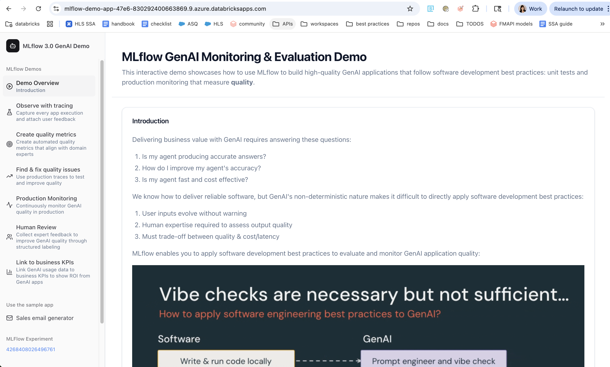
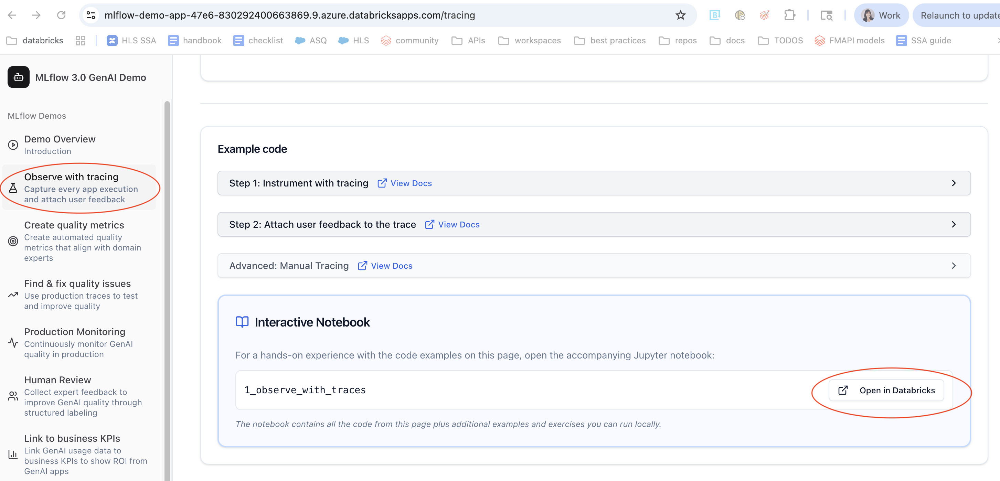
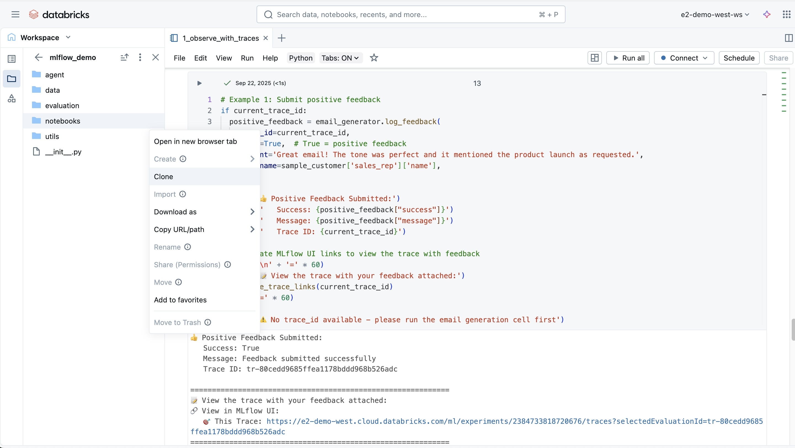
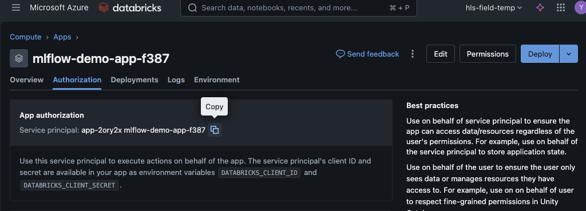
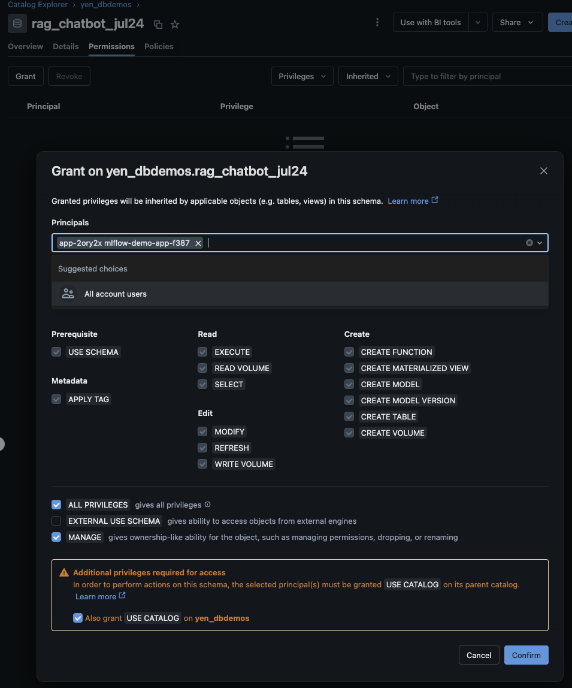
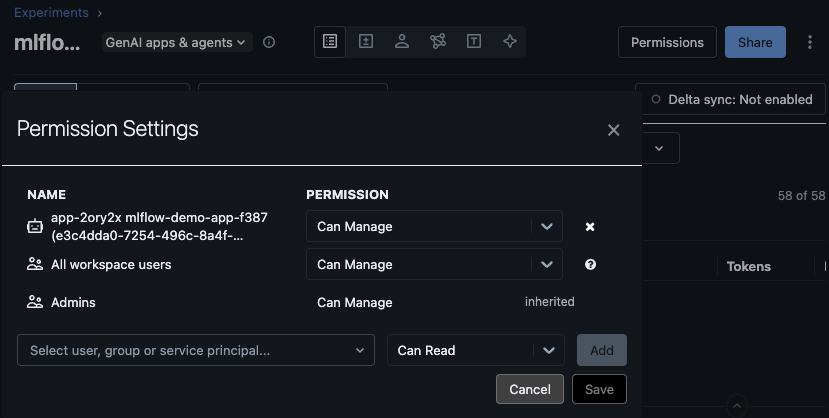
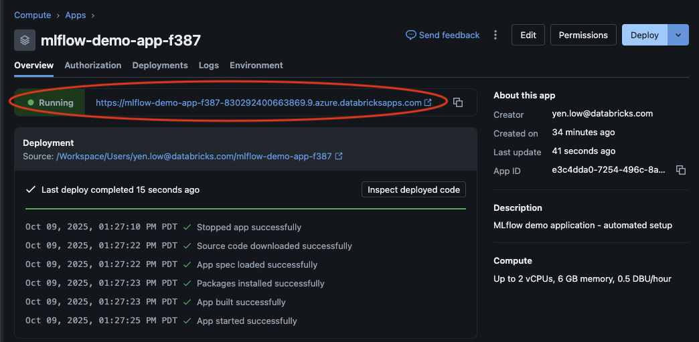

## Part 1\. Git clone on local terminal
1. On your local computer (not Databricks website)
   
   `git clone https://github.com/yenlow/mlflow-demo.git`

3. Read the original [README](README_original.md). Choose Option A (auto-setup)

   ```
   cd mlflow-demo
   ./auto-setup.sh
   ```

## Part 2\. Run auto-setup on local terminal
3. What `auto-setup.sh` does:  
   - call [`install-prerequisites.sh`](http://install-prerequisites.sh) to check and install the system prerequisites (Databricks CLI \>= 0.262.0, Python \>= 3.10.16, uv, bun)  
   - call `initialize-environment.sh` to do a uv sync according to uv.lock and bun install JS UI dependencies  
   - activate .venv  
   - call `auto-setup.py` to deploy to your Databricks workspace all the repo files, Delta tables, set up Databricks Apps, MLFlow Experiment for tracing via Databricks CLI and Databricks SDK. 
   **This process takes \~15 mins with at least 3 progress bars.**
        
4. `auto-setup.sh` will prompt for several inputs and options:  
   - Choose the Apps option (default), not Notebooks only option  
   - It will suggest catalogs and schema but you can also specify your own  
   - Apps name (pick the default)  
   - LLM serving endpoint (only tested with default Claude 3.7 Sonnet)  
   - You can enter the above when prompted or edit the `.env.local` file which will be the default options for prompting.<br>
   If you need to restart, delete the `.env.local` file so a fresh one will be created based on the prompted inputs.

**This setup process takes \~15 mins with at least 3 progress bars.**
 
5. If successfully set up, you will see this on your local terminal:

```shell
📊 Progress Summary: 16/16 completed
===================================================================
🚀 🚀 🚀  YOUR APP IS DEPLOYED - CLICK HERE TO START  🚀 🚀 🚀
===================================================================
🎯 👉 START HERE: https://mlflow-demo-app-47e6-830292400663869.9.azure.databricksapps.com
   ↳ This opens your deployed MLflow Demo App
   ↳ Interactive web interface with all features
   ↳ Learn how to use MLflow to improve GenAI quality
===================================================================
```

If issues arise, see [Troubleshooting](##Troubleshooting)

## Part 3\. Databricks workspace preparation
6. Go to the Databricks Apps link in the successfully deployed message


7. On the left menu, click on “Observe with tracing”. Scroll down to the Interactive Notebook 1\_observe\_with\_traces and click “Open in Databricks”


8. This will bring up the notebooks in your Workspace. Clone the notebooks to your personal folder so you don’t step on each other’s notebooks


## Troubleshooting
1. Check that you have the system prerequisites  
2. Check that you can [authenticate](https://docs.databricks.com/aws/en/dev-tools/cli/authentication) to your Databricks workspace (`databricks auth login`) based on an appropriate \~/.databrickscfg with the DEFAULT profile set up like [this](https://docs.databricks.com/aws/en/dev-tools/auth/config-profiles). See 

```
[DEFAULT]
host      = https://your_databricks_host.azuredatabricks.net
auth_type = databricks-cli
```

3. If you see this error:   
```
App status: ApplicationState.CRASHED - waiting...
⚠️  Timeout waiting for app 'mlflow-demo-app-f387' to be ready
⚠️  App deployment validation timed out
❌ Failed: Validate Deployment
   Error: Step execution failed
```
Check that you and the App's Service Principle (SP) have the right access to the catalog, schema selected
In Databricks:

a) Go to Compute > Apps > your_new_app_created > Authorization to copy the SP client ID


Then ensure the following permissions are set for App SP:
- USE CATALOG on 'your_catalog'
- ALL_PRIVILEGES + MANAGE on 'your_catalog.your_schema'
- CAN_MANAGE on MLflow experiment
- [OPTIONAL] CAN_QUERY on model serving endpoint 'databricks-claude-3-7-sonnet'

b) Go to Catalog > your_catalog > your_schema > Grant and grant SP the following:


c) Go to Experiments > your_experiment > Permissions to grant SP "manage" access:


d) Re-deploy the App once all the above permissions are properly set. The App url should be running
Compute > Apps > your_new_app_created > Deploy


e) `./auto-setup.sh --resume`

4. To start over, delete `.setup_progress.json`, `.env.local`


